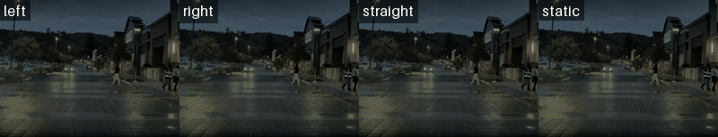

<div align="center">

# VATIX

### Scaling laws for flow-matching video diffusion models

Train, evaluate, and generate driving videos with latent video models from
1.6M to 9B parameters.

[](https://valeoai.github.io/VATIX/)
[](https://arxiv.org/abs/2608.28404)
[](https://www.python.org/)
[](https://huggingface.co/llvictorll/VATIX)

**Official implementation** · Oral presentation at the 6th DriveX Workshop,
in conjunction with ECCV 2026

</div>

## 🔎 At a glance

VATIX studies how validation loss changes with model size, training exposure,
and compute when training on 5,500 hours of real-world driving data.

| Finding | Result |
| --- | --- |
| Training exposure | The strongest source of gains under limited compute, with $\alpha_D \approx 0.74$ |
| Model size | Larger models reach lower asymptotic loss, with $\alpha_N \approx 0.21$ |
| Compute allocation | As compute increases, scaling shift from longer training to larger model sizes |
| Extrapolation | A law fitted through 1.1B parameters predicts the 9B model within 3.6% relative error |

### 📈 Model-size comparison

Sample from `19M` to `9B` parameters, showing the improvement as model size increases.

<p align="center">
  
</p>

### 🛣️ Trajectory-conditioned samples

The same context frame is generated by the 9B model under four commands: `left`, `right`,
`straight`, and `static`. The 9B trajectory-conditioned model was trained on the
[LUMI](https://www.lumi-supercomputer.eu/) supercomputer; see the [LUMI guide](docs/lumi.md).

<p align="center">
  
</p>
<p align="center">
  
</p>

## ✨ What you can do

- Train latent flow-matching video models with Hydra.
- Run single-GPU, DDP, FSDP, or Slurm jobs.
- Extract WAN latents from raw videos.
- Run evaluation on generated folders or produce evaluation videos.
- Steer generation with an ego-trajectory, using classifier-free guidance.

## ⚙️ Install

```text
.
├── main.py                      # Main training/evaluation entry point
├── conf/                        # Hydra configs (base + distributed presets)
├── vatix/
│   ├── trainer/                 # Training loop, generation, evaluation helpers
│   ├── dataset/                 # Dataset and dataloader logic
│   ├── network/                 # Model architectures + WAN VAE
│   ├── metrics/                 # FVD/FID/pixel metrics utilities
│   ├── utils.py                 # Checkpoint utilities
│   └── scripts/                 # Data/feature extraction scripts
├── launch/                      # Local + Slurm launch scripts
├── docs/                        # Extended tutorials and guides
├── examples/                    # Inference notebooks and examples
├── statics/                     # Demo/sample media used in README
├── ckpt/                        # Checkpoints output folder
└── real_videos/                 # Small raw-video subset folder
    ├── Nuscenes_random_samples/ #   plain MP4 clips
    ├── Nuscenes_traj_samples/   #   MP4 clips + matching ego-trajectories
    └── context_frames/          #   context frames for the trajectory demo
```

## Installation

Use Python 3.10+.

```bash
python3 -m venv vatix_env
source vatix_env/bin/activate
python -m pip install --upgrade pip setuptools wheel
pip install -e .
```

To install the pinned PyTorch packages with the project dependencies:

```bash
pip install -e ".[torch]"
```

Download the WAN 2.1 VAE required for training, latent extraction, and
inference:

```bash
hf download llvictorll/Vatix wan21/wan_2.1_vae.pth --repo-type model --local-dir ./ckpt
```

### Inference

Run the ready-made Hugging Face image-to-video example from the repository root:

```bash
python examples/inference_huggingface.py --input-image real_videos/context_frames/sample2_canada.png
```

The `--input-image` argument is a variable for the conditioning frame, so you can replace it with any other image path you want to use.

This downloads the published `1B_traj` checkpoint and generate video
`sample2_canada_future.mp4`.

## ▶️ Run

Trajectory-conditioned (example):

```bash
bash launch/base.sh base data=mp4_traj data_folder=./real_videos/Nuscenes_traj_samples use_trajectory_cond=true global_bsize=2
```

`use_trajectory_cond=true` also enables, at training time: an auxiliary waypoint-prediction head
(weight 0.1, supervised on a `shared_timestep_prob` fraction of the steps, dropped on reload), SavGol
smoothing of the waypoints, horizontal-flip augmentation, and a separate optimizer group for the
trajectory parameters (`trajectory_weight_decay`, default 0, and `trajectory_embed_lr_mult`).

Multi-GPU DDP:

```bash
bash launch/base.sh base
```

Run trajectory-conditioned training on the included example videos:

```bash
bash launch/base.sh base \
  data=mp4_traj \
  data_folder=./real_videos/Nuscenes_traj_samples \
  use_trajectory_cond=true \
  global_bsize=2
```

Run on four local GPUs:

```bash
NPROC_PER_NODE=4 bash launch/base.sh multi_gpu_ddp
```

Hydra overrides can be added after the experiment name. Run commands from the
repository root so Hydra can resolve `conf/config.yaml`.

## 🧭 Where to go next

- [Project webpage](https://valeoai.github.io/VATIX/) — project overview and
  generated samples.
- [Research paper](https://arxiv.org/abs/2608.28404) — scaling laws for video
  diffusion models trained on driving data.
- [Full latent-data tutorial](docs/full_tutorial.md) — extract latents, create
  splits, and train on a small subset.
- [Technical guide](docs/technical_guide.md) — configuration, data preparation,
  distributed training, checkpoints, Python inference, and evaluation.
- [LUMI guide](docs/lumi.md) — installation, environment, and Slurm scripts for
  inference and training on LUMI (AMD GPUs).
- [Inference notebook](examples/inference_video_model.ipynb) — interactive
  video generation.
- [Licenses](licenses/) — code, model, data, and third-party notices.

## 🗂️ Repository map

```text
main.py       Training and evaluation entry point
conf/         Hydra configuration and experiment presets
vatix/        Dataset, network, trainer, metrics, and scripts
launch/       Local and Slurm launchers
docs/         Tutorials and technical documentation
examples/     Inference notebooks
statics/      README media
```

## 💾 Data and models

The pipeline accepts raw MP4 files (`data=natix`) or extracted WAN latent files
(`data=natix_feat`). The NATIX dataset is access-controlled and non-commercial;
follow its upstream terms before using it.

Pretrained checkpoints are available from
[Hugging Face](https://huggingface.co/llvictorll/VATIX). Checkpoint layouts and
resume commands are documented in the [technical guide](docs/technical_guide.md).

## 📄 Citation

```bibtex
@inproceedings{besnier2026how,
  title={How Far Can 5,500 Hours of Driving Take You? A Scaling Law Analysis of Video Diffusion Models},
  author={Victor Besnier and Anh-Quan Cao and Elias Ramzi and Spyros Gidaris and Tuan-Hung Vu and Andrei Bursuc and Eloi Zablocki and Matthieu Cord},
  booktitle={[Archival Track] ECCV 2026 DriveX - 6th Workshop on Foundation Models for Autonomous Driving},
  year={2026},
  url={https://arxiv.org/abs/2608.28404}
}
```

## 🙏 Acknowledgements

VATIX uses components from WAN and the NATIX Multi-Camera Driving Dataset.
Training used HPC resources from IDRIS, EuroHPC MareNostrum 5, and EuroHPC LUMI.

We acknowledge the EuroHPC Joint Undertaking for awarding the project IDs EHPC-AIF-2026FL01-008,
EHPC-AIF2026FL01-258, and EHPC-AIF-2026LS11-001 access to the EuroHPC supercomputer MareNostrum 5,
hosted by the Barcelona Supercomputing Center (BSC), Spain, and the project ID EHPC-AIF-2026FL01-544
access to the EuroHPC supercomputer LUMI, hosted by CSC (Finland) and the LUMI consortium.

Copyright (c) 2026 Valeo. Victor Besnier. All rights reserved.